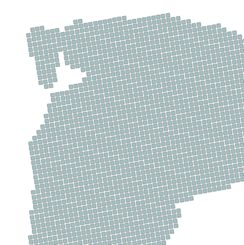

# Affine Transformations in PostGIS

__TAGS:__ postgis, affine, transformations, matrix, matrices, translations, scaling, rotation

## Motivation

Affine transformations on the plane are the mathematical formal denomination for geometric operations such as rotations, scalations, translations, and other relocation and/or alteration operations that can be performed on a vector or raster dataset. Affine transformations are seldom used in GIS because their very reason of existence is to modify the shape and position of geometric data, and this is a rarely needed or wanted operation to perform on existing geographic data.

However, is nice to have the posibility to perform such operations from a semiology point of view. In this article we will revise the basics of affine transformations, affine transformation composition, and a usage case in PostGIS.

If you want to know more about the formal mathematical definition of affine transformations check this links:

TODO

  - d
  - w

We are about to review the practical implications of this mathematics procedures.

## Use Case

For a certain project, we have been working with territorial grids of different sizes, all of them derived from the European Reference Grid of 1 km (you can check the original data at [1 km EEA Reference Grid][0]). Data is summarized on this grids because of the sensitive nature of some of them, resulting in a structure like this:


However, we wanted to create an effect of deattachment between the cells of the grid. We tried several approaches with Quantum GIS, for example representing rotated square symbols at cell's centroids:



or using a broad, white outline on the cells:


But this solutions are only valid inside Quantum, and are not easily translated to other mapping platforms we use like GeoServer, or at least not without redoing all the semiology. Another solution must be find, and it is to redefine in a view the geometries of the cells themselves inside PostGIS. This can be done with affine transformations.

[0]: http://www.eea.europa.eu/data-and-maps/data/eea-reference-grids-2


__TALK ABOUT THE CRS__

## Affine Transformations in PostGIS

Check this polygon:


It is a rather complex polygon almost centered at 0,0, as can be seen from the axis in the image.

PostGIS includes functions to easily apply basic affine transformations to geometries, both in 2D and 3D. We cover only 2D transformations in this article. For example, to translate a geometry, we can use __st_translate__:

```sql
geometry st_translate(geometry g1, float deltax, float deltay);
```

__st_translate__ takes a geometry _g1_ and two translate factors, _deltax_ and _deltay_, that moves the geometry in x and y components. PostGIS does this just by translating all vertex in the polygon by this magnitude. To move the polygon 1000 meters left and 500 down:

```sql
select st_translate(
  (select geom from affine.data where gid=1),
  -1000,
  -500);
```
	  
The effect of this translation is:


Rotations are also easy, using functions __st_rotatex__ and __st_rotatey__:

```sql
geometry st_rotatex(geom g1, float radians);
```

This function rotates geometry _g1_ _radians_ radians around the x axis:

```sql
select st_rotatex(
  (select geom from affine.data where gid=1),
  pi()/3);
```


Note that the distortion of the polygon is due to project to a plane a rotation
on the x axis \(\pi\)/3 radians. Same to rotate around the y axis:

```sql
select st_rotatey(
  (select geom from affine.data where gid=1),
  pi()/3);
```


And finally a rotation around the z axis, the axis that is perpendicular to the screen plane:

```sql
select st_rotatez(
  (select geom from affine.data where gid=1),
  pi()/3);
```


KATEX test: $$\pi$$ $$a \ne 0$$

$$f(x) = \int_{-\infty}^\infty \hat f(\xi)$$

