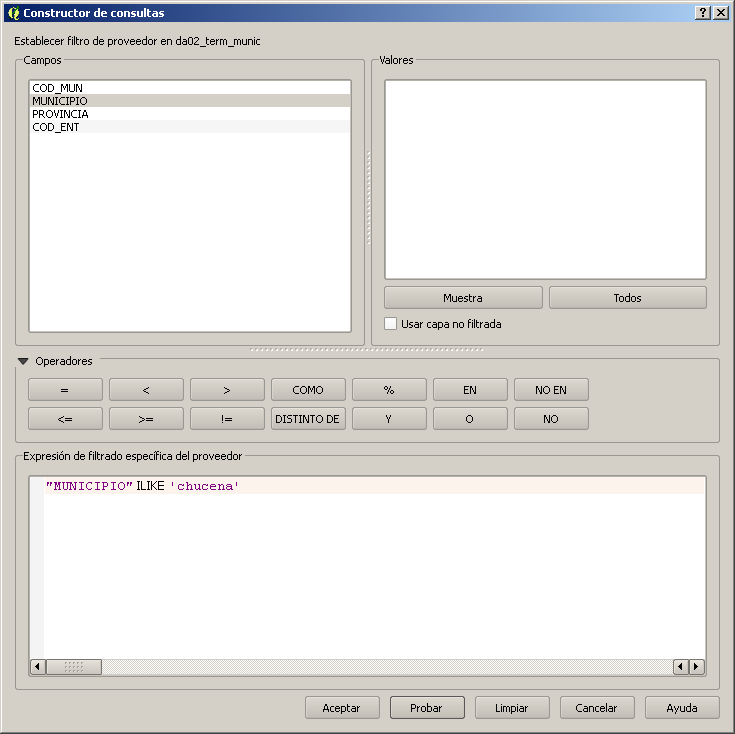
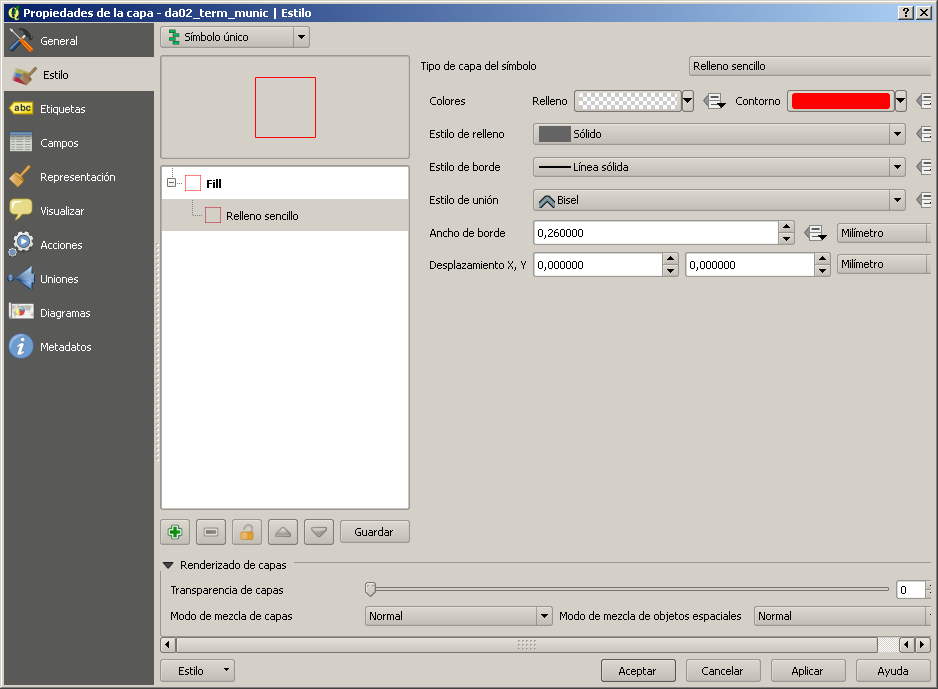
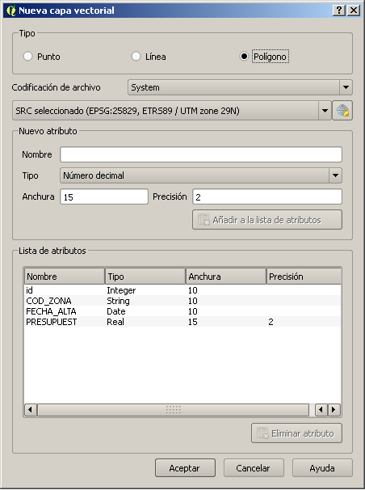
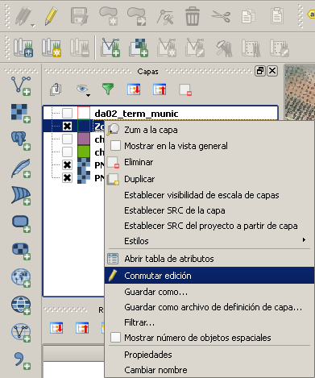
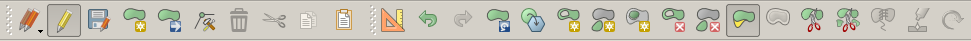
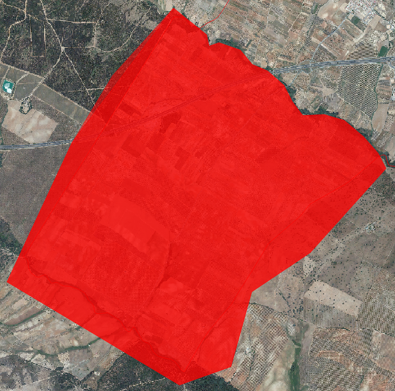
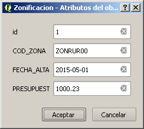
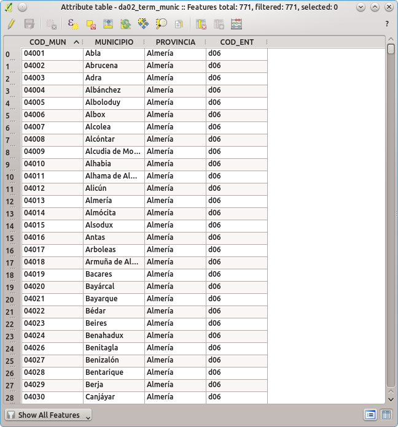

TODO: origen de la información: o la buscais o la digitalizáis.

TODO: principales fuentes de información geográfica.

TODO: WMS


# Práctica 02: Edición de información vectorial

__Quantum GIS__ puede, gracias a la librería __GDAL/OGR__, leer una gran variedad de fuentes de información ráster y vectorial. Entre las más conocidas:

- vectoriales:
  - ESRI Shapefile;
- ráster:
  - GeoTIFF;
  - MrSID;
  - ECW;


__QGIS__ guarda sus proyectos en ficheros de texto con la extensión __.qgs__. No guarda los datos, sólo guarda enlaces a los mismos. Aparte de dichos enlaces, parte de la información que se guarda en un .qgs incluye:

- organización de capas en el _TOC_;
- propiedades asignadas a la capa;
- semiología cartográfica;
- proyecciones;
- extensión de los datos;
- marcadores geográficos;
- composición de mapas.

Se va a editar información en formato ESRI Shapefile, uno de los formatos de información geográfica más utilizados. El formato Shapefile guarda información vectorial de punto, línea o polígono (nunca mezclados), junto a un índice espacial que acelera su uso y una tabla de datos alfanuméricos en formato __.dbf__. Además, puede llevar también información de sistema de referencia.

Como contexto de digitalización, procederemos primero a cagar la capa de municipios, __Vectorial\da02_term_munic__, y filtraremos el municipio de __Chucena__. Para ello:

- hacer click derecho en el _TOC_ sobre la capa a la que se le quiere aplicar el filtro. Seleccionar __Propiedades__, con lo que aparecerá el cuadro de propiedades de la capa;

- seleccionar la sección, el en lateral izquierdo, __General__;

- ya que estamos, seleccionar el __SRC__ correcto en el caso de que no estuviera bien especificado (sección __Sistema de referencia de coordenadas__). Las definiciones de __SRC__ de ESRI no son bien interpretadas por Quantum;

- el filtro se crea en la sección __Subconjunto de objetos espaciales__. Pulsamos sobre __Constructor de consultas__ y aparecerá un cuadro de diálogo en el que veremos las columnas de la tabla de datos alfanuméricos de la capa, así como un interfaz con el que podremos crear la expresión de filtrado requerida. La expresión es:

```Sql
"MUNICIPIO" ILIKE 'chucena'
```



- __ILIKE__ hace una búsqueda de texto sin tener en cuenta las mayúsculas. Pulsamos __Aceptar__, pero no salimos de las propiedades.

Ahora vamos a alterar la semiología de la capa para que el relleno sea transparente y quedarnos sólo con el borde:

- seleccionamos en el lateral izquierdo la sección __Estilo__;

- en el cuadro de jerarquía de estilos, pulsamos sobre __Relleno sencillo__;

- en la parte derecha del cuadro de diálogo aparecerá las propiedades del tipo de semiología __Relleno sencillo__. Lo que nos interesa es alterar el tipo de relleno, en la sección __Colores__. Pulsamos sobre la flecha invertida y seleccionamos __Relleno transparente__. Cambiamos asimismo el color del contorno pulsando en el color y seleccionamos un color llamativo, como un rojo.



- cargamos adicionalmente las dos ortofotos del PNOA, ya que las vamos a utilizar como base de digitalización.

Para crear una capa, accedemos al menú __Capa > Nueva > Nueva capa de archivo shape__. Se abrirá un cuadro de diálogo para configurar la nueva capa de información, tanto en sus aspectos geométricos como alfanuméricos. Vamos a crear un simulacro de zonación urbana y rústica para implementar un plan de actuación fictício:

- asignamos como tipo de capa __Polígono__;

- seleccionamos el sistema de coordenadas, en este caso, el del proyecto, __EPSG:25829__, ETRS89 UTM29N;

- creamos un atributo temático, por ejemplo, __COD_ZONA__, de tipo __Datos de texto__, anchura 10, y pulsamos __Añadir a la lista de atributos__;

- de igual manera, creamos otro campo que sea __FECHA_ALTA__, de tipo __Fecha__, y por último, uno llamado __PRESUPUEST__ (en una Shapefile, los nombres de los campos no pueden tener más de 10 caracteres de largo), de tipo __Número decimal__, de anchura 15 y precisión 2;



- pulsamos __Aceptar__ y el sistema nos preguntará por un directorio y nombre para dejar la shape. Hay que tener en cuenta que una Shapefile se compone de mínimo 3 ficheros principales: __.shp__ (datos geométricos), __.dbf__ (datos alfanuméricos) y __.shx__ (índice espacial). Llamaremos a la shape __Zonificacion__.

La nueva Shapefile se añade al _TOC_. Para que no nos entorpezca la visión de la ortofotografía, debemos alterar su semiología de la misma forma que alteramos la del municipio de forma que su fondo sea transparente y su contorno de un color destacado.

Para comenzar a editar la nueva capa, debemos primero habilitar la edición. Ningún dato podrá ser alterado hasta que no se realice esta acción. Para ello tenemos dos posibilidades:

- con la capa a editar marcada en el _TOC_, pulsamos el botón __Conmutar edición__ de la barra de edición (el lápiz amarillo);

- hacemos click derecho sobre la capa en el _TOC_ y seleccionamos __Conmutar edición__.



Una vez la edición está conmutada aparece un icono de lápiz a la izquierda del nombre de la capa en el _TOC_, indicando que dicha capa está en edición. Ojo, podemos tener muchas capas en edición. Las acciones de edición recaerán en última instancia en aquella capa que está seleccionada en el _TOC_, marcada con un resalte.

La barra de herramientas de edición se ha activado. Ahora podemos seleccionar la herramienta necesaria para lo que queramos hacer. Por ahora, dibujar un simple polígono, con lo que seleccionaremos la herramienta __Añadir objeto espacial__.



Ahora podemos ir definiendo el polígono vértice a vértice. El proceso puede ser interrumpido en cualquier momento para seleccionar herramientas de navegación y centrar la vista, pudiéndose retomar cuando haga falta seleccionando de nuevo la herramienta de __Añadir objeto espacial__. Para terminar de digitalizar, se pulsa el botón derecho (que no insertará ningún vértice).



En cuanto la geometría del nuevo objeto ha sido definida, __Quantum__ nos solicita su información alfanumérica mostrando un cuadro de diálogo donde podemos introducir los datos que definimos anteriormente. Las fechas han de introducirse en formato __ISO__ (año-mes-día), y los números decimales con un punto en lugar de coma.



El polígono se verá definido con una marca encima de cada uno de sus vértices. Comoquiera que la capa aún está en edición, dichos datos no han sido guardados aún en la capa. Para ello se ha de pulsar la herramienta de __Guardar cambios en la capa__ o desactivar la edición, en cuyo momento nos preguntará si queremos guardar los datos.

Con la capa en edición y el polígono marcado podemos utilizar la __Herramienta de nodos__ para alterar su posición, insertar nuevos nodos entre dos ya existentes o borrarlos:

- para modificar la posición de un nodo, pulsar sobre él y arrastrar a su nueva posición;

- para crear un nuevo nodo, pulsar primero el segmento sobre el que se quiere insertar. Los nodos extremo se marcarán en otro color. Hacer doble click en el lugar dónde se quiere insertar el nuevo;

- para eliminar un nodo, seleccionarlo y pulsar la tecla __Supr__.

## Ejercicio

Crear una Shapefile lineal llamada __vias_comunicacion__ y proporcionarle los atributos necesarios para digitalizar las vías de comunicación y su tipología presentes en el municipio, por ejemplo: grandes vías de comunicación (autovía), caminos rurales, carreteras comarcales, trazado urbano, etc.


## Edición de información alfanumérica

La información alfanumérica también se ve afectada por la edición, como no podía ser de otra manera. Cuando una capa está en edición, sus datos alfanuméricos también pueden ser editados gracias al control tabla.


Las herramientas para trabajar con la tabla son, de izquierda a derecha:



- __conmutar edición:__ misma función que el conmutar edición de la barra de edición estándar;

- __guardar edición:__ misma función que el conmutar edición de la barra de edición estándar;

- __eliminar los objetos seleccionados:__ borra los objetos seleccionados;

- __seleccionar objetos con una expresión:__ permite seleccionar objetos en base a sus atributos alfanuméricos;

- __deseleccionar todo:__ eliminar la selección actual;

- __mover la selección arriba:__ situa en la parte superior de la tabla los objetos seleccionados actualmente;

- __invertir selección:__ invierte la selección actual (deselecciona los seleccionados y viceversa);

- __desplazar el mapa a los seleccionados:__ desplaza el mapa para centrarse en los elementos seleccionados;

- __zoom sobre los seleccionados:__ hace zoom sobre los elementos seleccionados;

- __copiar filas seleccionadas:__ mete en el portapapeles los datos de las filas seleccionadas;

- __eliminar columna:__ elimina la columna seleccionada;

- __crear nueva columna:__ crea una nueva columna;

- __calculadora de campos:__ herramienta para hacer calculos con los datos de las filas.

