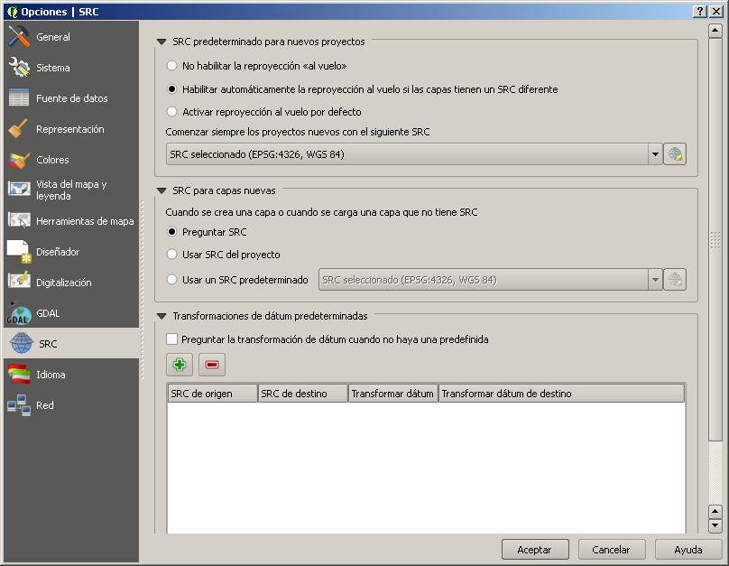
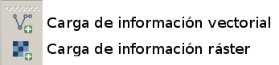
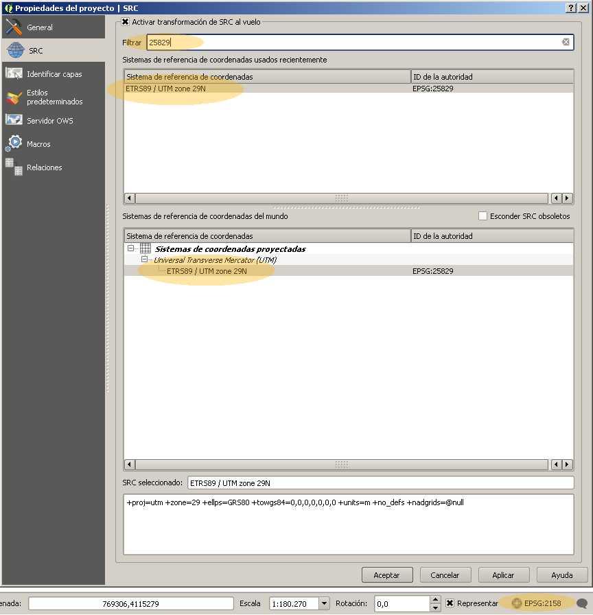
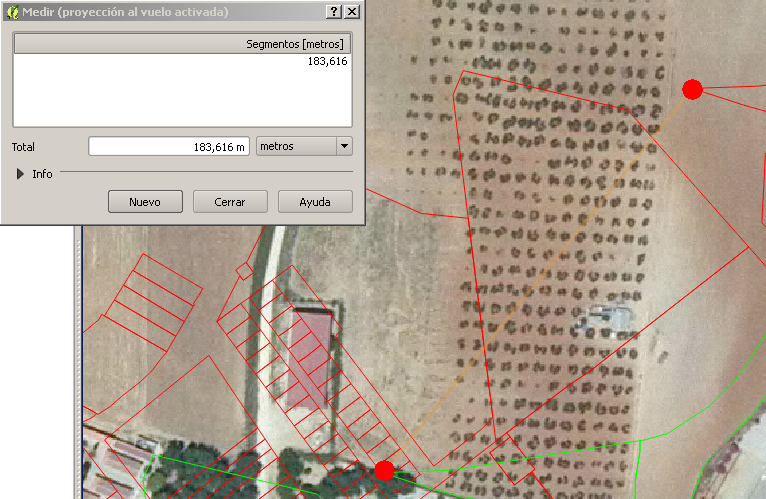
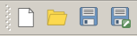

# Práctica 01: Sistemas de coordenadas

## Motivación

En esta práctica veremos los efectos, a menudo desastrosos, que puede tener el mezclar en un mismo proyecto de sistema de información geográfica información geométrica cuyas coordenadas están expresadas en distintos sistemas de referencia (llamados normalmente __SRC__ o __CRS__, en inglés). Para poder utilizar con éxito en un mismo proyecto fuentes de datos con distintos SRC, es necesario que se den dos condiciones:

- conocer los SRC __de origen__ de cada fuente de datos. Téngase en cuenta, además, que muchos son muy parecidos, diferenciándose tan sólo en algún parámetro geodésico de su definición;

- conocer qué mecanismos de transformación de datums (__datums shiftings__, en inglés) tenemos a nuestra disposición y estimar por tanto la bondad del ajuste de dichas capas.

## Desarrollo

### Configuración básica de la práctica

Antes de cargar una capa, abrimos el menú __Configuración>opciones>SRC__. Nos aseguramos que la opción __SRC para nuevas capas__ tiene activada la opción __Preguntar SRC__. De esta manera, cada vez que carguemos en _QGIS_ una capa que no tenga definido el CRS de forma explícita (cada formato de dato lo hace de una manera diferente), nos pedirá que seleccionemos el correcto.

Como base de referencia vamos a utilizar las ortofotografías pancromáticas de máxima actualidad (al menos a fecha de Mayo de 2015) del [Plan Nacional de Ortofotografía Aérea del Instituto Geográfico Nacional][0], concretamente los mosáicos pertenecientes a las hojas de la seria 1:50.000 983 y 1001, donde se encuadra el municipio de Chucena. Se encuentran en el directorio __Raster__, y responden a los siguientes nombres:

- __PNOA_MA_OF_ETRS89_HU29_h50_0983.ecw__;

- __PNOA_MA_OF_ETRS89_HU29_h50_1001.ecw__.

El nombre de los ficheros ya nos está dando pistas que nos indican que su sistema de coordenadas es __ETRS89 UTM zona 29 norte__, aunque esta información precisa la hemos obtenido de la documentación del portal del PNOA. Por tanto, el código EPSG del sistema de referencia es el __25829__, como corresponde a la provincia de Huelva.

Cargamos las ortos con la herramienta de carga ráster:

Sin embargo, como podemos observar en la barra de estado de Quantum, el programa identifica erróneamente el sistema de coordenadas como un tal __EPSG:2158, IRENET95 / UTM zone 29N__, que no es el que sabemos que es. Para cambiarlo, entramos en las propiedades de ambas capas con botón derecho sobre sus nombres en el _TOC_, y en la pestaña __General__ cambiamos a __EPSG:25829__. Cambiamos también el sistema de coordenadas del proyecto a __EPSG:25829__ pulsando sobre el código del mismo en la barra de estado, no olvidando activar la opción de __Activar transformación de SRC al vuelo__. En la siguiente imagen se puede ver el sistema actual del proyecto indicado en la barra inferior de estado, así como el cuadro de diálogo de selección de SRC que aparece al pulsar sobre dicho indicador. La mejor forma de buscar el SRC que deseamos es escribir su código EPSG en el campo __Filtrar__.

[0]: http://pnoa.ign.es/es

### Carga de información en distintos sistemas de coordenadas

Para ver el desvío que se produce entre el antiguo datum europeo __ED50__ y el nuevo __ETRS89__, vamos a cargar tres capas vectoriales en el proyecto, que se encuentran en la carpeta __Vectorial__:

- __chucena_rustico.shp:__ catastro rústico de Chucena, en sistema __EPSG:25829__ (ETRS89 UTM29N);

- __chucena_urbano.shp:__ catastro urbano de Chucena, en sistema __EPSG:25829__ (ETRS89 UTM29N);

- __chucena_urbano-23029.shp:__ catastro urbano de Chucena, en sistema __EPSG:23029__ (ED50 UTM29N).

Establecemos el sistema de referencia del proyecto también a __EPSG:25829__.

Podremos observar el desfase típico entre el datum __ED50__ y el __ETRS89__ de 180 metros si comparamos las capas __chucena_urbano-23029__ y __chucena_urbano__. El desfase se debe a que Quantum no sabe como solventar el desfase de datum, cómo convertir las coordenadas de un sistema a otro, por lo que lo que hace es simplemente interpretar las coordenadas ED50 UTM29N como si fueran ETRS UTM29N, por lo que se produce el desfase.

En la imagen anterior podemos apreciar el error del desfase. Los puntos marcados en rojo deberían ser coincidentes, y sin embargo están separados una distancia de 183 metros.

### Carga de la rejilla de transformación para España en Quantum GIS

Este problema se soluciona configurando la transformación entre ambos datums en Quantum GIS. Existen transformaciones numéricas de 3, 5 y 7 parámetros, que proporcionan crecientes niveles de ajustes, pero el método más preciso para convertir coordenadas de un datum a otro es la utilización de una rejilla geodésica. Dicha rejilla es una matriz numérica que transforma puntos de coordenadas clave (los vértices geodésicos) de un sistema a otro, y que por tanto sirven de apoyo para la transformación de cualquier otro punto del espacio. Las realizan los organismos geodésicos nacionales, y están sujetas a revisiones y mejoras periódicas para aumentar su precisión.

Vamos a cargar en el sistema la rejilla para la península ibérica (exceptuando Galicia). Se encuentra en el directorio __GSB__ y se llama __PENR2009.gsb__. Dicho fichero hay que copiarlo a la carpeta __share\proj__ del directorio de instalación de Quantum, que por defecto es __c:\Archivos de programa\QGIS Wien\__. Es el directorio de la librería geodésica __PROJ.4__ que es la que hace los cálculos geodésicos en Quantum.

Sin embargo, la utilización de la rejilla no es automática, sino que hay que modificar la definición del sistema de referencia en Quantum para que la tenga en cuenta. Es un procedimiento complejo que vamos a omitir, y nos limitaremos a copiar el fichero __srs.db__ a la carpeta __apps\qgis\resources__ dentro de la carpeta de instalación de Quantum. El fichero __srs.db__ contiene las definiciones de los sistemas de referencia que utiliza Quantum, y esta versión está modificada para que los sistemas basados en el datum __ED50__ tengan en cuenta la rejilla a la hora de transformar coordenadas hacia el __ETRS89__. Guardamos el proyecto, reiniciamos Quantum y volvemos a abrirlo. El ajuste debe ser ahora perfecto.

La barra de proyecto, de izquierda a derecha:

- nuevo proyecto;

- abrir proyecto (con extensión __.qgs__);

- guardar proyecto;

- guardar como.

Hay que destacar que un proyecto __.qgs__ no guarda los datos geográficos, sino simplemente referencias a las fuentes de los mismos (por ejemplo, la ubicación de un fichero shape), más una cantidad ingente de información relacionada, por ejemplo, semiología.
