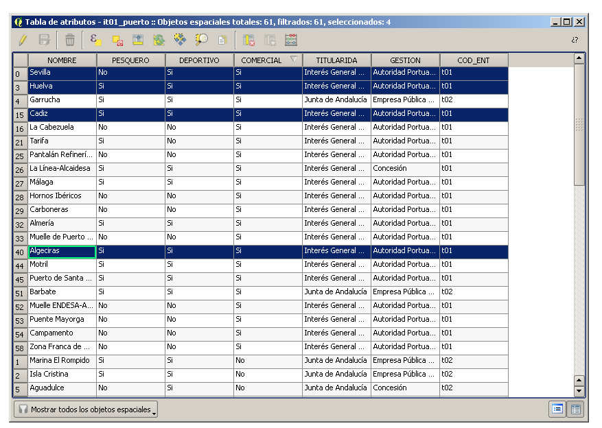
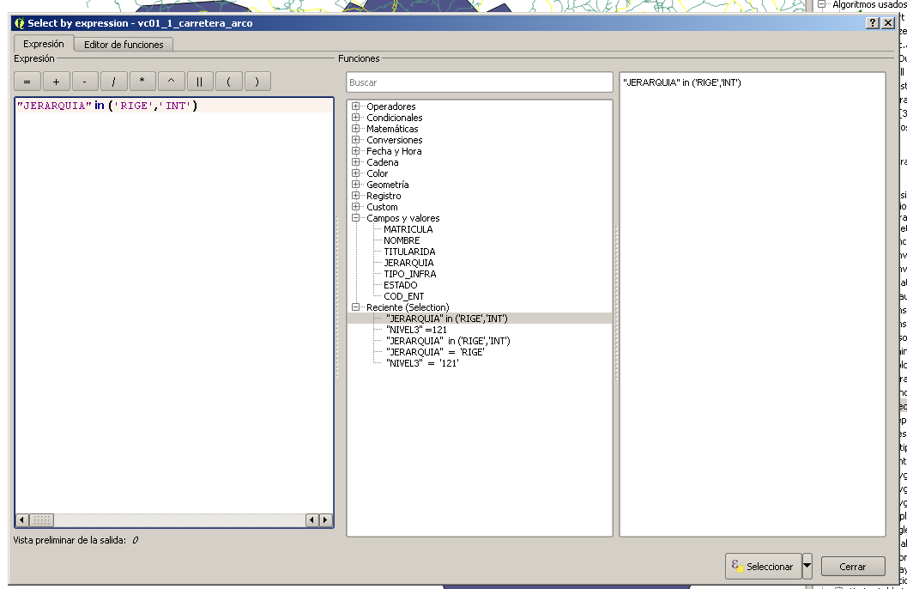

# Ubicación de un centro logístico para operaciones portuarias

Una empresa de logística portuaria pretende crear un centro logístico nuevo que sirva a sus actividades en los puertos de Huelva, Sevilla, Cádiz y Algeciras. Las mercancías se mueven con camiones entre los puertos y el centro logístico y se deben cumplir los siguientes requisitos de optimización de la ubicación:

- el centro logístico debe estar ubicado en una zona industrial;

- debe estar comunicado con los puertos objetivo por carreteras de alta capacidad;

- debe estar lo más central posible a los puertos, pero teniendo en cuenta el volumen de mercancías que se mueven anualmente en cada uno de ellos.

Nuestra información de partida es:

- una capa de instalaciones portuarias (it01_puerto.shp);

- una capa de usos del suelo (us01_usos.shp);

- una capa de carreteras (vc01_1_carretera_arco.shp).

## Selección de los puertos objetivo

Cargamos la capa it01_puerto.shp y abrimos su tabla de atributos, buscando los puertos comerciales de Huelva, Sevilla, Cádiz y Algeciras. Los seleccionamos y los aislamos en una nueva capa llamada __puertos_objetivo.shp__ para más comodidad.




Para delimitar el área de estudio a una zona razonable, vamos a crear una zona de influencia (buffer) de 50 kilómetros alrededor de cada puerto. Utilizaremos la herramienta QGIS > Vector geometry tools > Fixed distance buffer.


Crearemos a partir del buffer una capa nueva que llamaremos __zona_interes.shp__. Comprobar su sistema de referencia.


## Selección de las carreteras de alta capacidad

Para seleccionar las carreteras de alta capacidad, haremos una selección sobre la capa __vc01_1_carretera_arco.shp__ buscando las categorías __RIGE__ e __INT__ en el campo __JERARQUIA__.




Al igual que hicimos con los puertos, esta selección la aislaremos, por comodidad, en una nueva capa que llamaremos __carreteras_aptas.shp__.


Para más comodidad, recortaremos las carreteras seleccinadas con la herramienta __QGIS > Vector overlay tools > Clip__ con la capa __zona_interes__.


Crearemos una capa llamada __carreteras_aptas_clip.shp__.


## Selección de usos del suelo

Seleccionaremos de la capa __us01_usos.shp__ los usos del suelo que correspondan con zonas industriales. Dicha capa tiene un campo llamado __NIVEL3__ con un código numérico de tres cifras. Dichos códigos son códigos del programa europeo para cobertura de uso del suelo CORINE-LANDCOVER, que utiliza una clasificación jerárquica para dicha clasificación. La categoría que se corresponde con las zonas industriales es la 121, así que seleccionamos dicho uso con la herramienta de selección.


Dicha selección la salvamos en una nueva capa llamada __zona_industrial__. A dicha capa le realizamos, al igual que a las carreteras, un clip con la capa __zona_interes__, a la que llamaremos __zona_industrial_clip__. Los usos del suelo son multipolígonos agrupados por categorías, pero como nos interesa cada zona industrial por separado, utilizaremos la herramienta __Multipolygon to singlepolygon__ para convertir el multipolígono en polígonos simples. Llamaremos al resultado de esa capa, de nuevo, __zona_industrial__.

## Tratamiento del coste de tránsito a través de carretera

Hemos de calcular o estimar de alguna manera cuantitativa el coste de movimiento de los camiones por carretera. Comenzaremos por una fricción clásica por distancia para ir matizando dicha fricción en función de otros parámetros.

Creamos en __carreteras_aptas_clip.shp__ un campo nuevo de tipo entero llamado __friccion__. Seleccionamos las carreteras de tipo __RIGE__ (las de mayor capacidad) y le asignamos una fricción de 1. Seleccionamos después las de tipo __INT__ y les asignamos una fricción de 3. Esto modeliza el hecho de que moverse por la RIGE es menos costoso para un camión que hacerlo por la INT.

Sin embargo, matizaremos un poco más. La autovía AP-4 Sevilla - Cádiz es de peaje, así que la penalizaremos con más fricción. Seleccionamos los tramos de carretera que tengan el campo __MATRICULA__ igual a __AP-4__ y le añadimos dos puntos adicionales de fricción con la calculadora de campos. Penalizaremos mucho la SE-30 de circunvalación de Sevilla, seleccionando en el campo __MATRICULA__ el valor __SE-30__ y asignándole 5 puntos adicionales de fricción con la calculadora de campos.

Con esto tenemos un modelo simple de coste de movimiento por carretera. Ahora tenemos que ver el coste acumulado por distancia de tránsito desde cada uno de los puertos objetivo.

Para ello, vamos a utilizar técnicas ráster de la librería de geoprocesamiento del venerable GRASS, antipático como pocos pero el más potente, sobre todo en ráster. Con la herramienta __v.to.rast.attribute__ vamos a rasterizar la capa __carreteras_aptas_clip.shp__ en función del campo __friccion__, con 500 metros de resolución y amplitud del ráster coincidente con la capa __zona_interes.shp__. Con ello conseguiremos una capa ráster que llamaremos __coste_carreteras__. Comprobamos el sistema de coordenadas y aplicamos una semiología que nos permita observar los costes de fricción para cada tramo de 500 metros de carretera.

Ahora tenemos que enganchar los puertos objetivo a la red de carreteras rasterizada que acabamos de crear. Como son polígonos, no pueden hacerlo directamente, así que los abstraeremos con puntos que situaremos manualmente sobre la red ráster de carreteras en su punto más cercano. Creamos por tanto una capa nueva vectorial llamada __puntos_puertos__ con un campo __puerto__ en el que introduciremos el nombre del mismo. Digitalizamos cuatro puntos representando a cada uno de los puertos, teniendo mucho cuidado de que dichos puntos caen dentro de un píxel del ráster de __coste_carreteras__.

Ahora tenemos que calcular el coste de tránsito acumulado para cada puerto a lo largo de la red de carreteras. Para ello utilizaremos un módulo de GRASS llamado __r.cost.full__. Seleccionamos primero el puerto para el que vamos a calcular el coste acumulado con la herramienta de selección y lanzamos la herramienta, seleccionando como capa de coste unitario __coste_carreteras__ y como punto de comienzo de cálculo de coste __puntos_puertos__. Al estar seleccionado uno de ellos, sólo dicho puerto intenvendrá como origen del coste. La resolución del ráster resultante será también de 500 metros y como extensión seleccionaremos otra vez la capa __zona_interes__. Esta configuración la repetiremos para todos los ráster que creemos a partir de ahora.

De esta manera, crearemos cuatro capas ráster, una por cada puerto, a las que llamaremos __coste_huelva__, __coste_sevilla__, __coste_cadiz__ y __coste_algeciras__. Debemos comprobar el sistema de coordenadas de cada uno de ellos y establecerlo en caso necesario en el __EPSG:25830__, ya que a GRASS le cuesta comunicarse con __QGIS__ en este aspecto aún. Le damos una semiología apropiada y veremos cómo se distribuye el coste acumulado para cada puerto.

Si sumáramos ahora los costes parciales calculados, tendríamos una muy buena medida de centralidad en la red, encontrando los puntos de menor coste acumulado entre Sevilla y Cádiz. Sin embargo, tenemos que ponderar los costes porque no es lo misma la actividad que genera para la compañía el puerto de Algeciras que el de Huelva. Cada puerto mueve al año toneladas de mercancía por estos valores:

- __Algeciras:__ 190.000 Tn;
- __Sevilla:__ 120.000 Tn;
- __Cádiz:__ 70.000 Tn;
- __Huelva:__ 25.000 Tn.

Por lo tanto, dado que Algeciras y Sevilla van a generar la mayor cantidad de tráfico de camiones dentro de la compañía, tiene sentido que modelicemos este peso relativo a la hora de tener en cuenta la ubicación óptima a lo largo de la red.

Por lo tanto, creamos un nuevo campo decimal en __puntos_puertos__ llamado __tonelaje__ e introducimos los datos anteriores. Creamos otro que llamaremos __coef_coste__, decimal, y con la calculadora de campos introducimos la siguiente fórmula sencilla:

```Sql
coeficiente coste = tonelaje puerto / máximo de tonelaje en cualquier puerto
```

Con lo que los valores de ponderación del coste acumulado de tránsito para cada puerto será:

- __Algeciras:__ 1;
- __Sevilla:__ 0.63;
- __Cádiz:__ 0.36;
- __Huelva:__ 0.13.

De esta manera, una distancia grande desde el puerto de Huelva (poca actividad) penalizará menos que una gran distancia desde el puerto de Algeciras (muchísima actividad), con lo que la centralidad en la red se decantará hacia Algeciras alejándose de Huelva.

Para realizar el cálculo final de coste (álgebra de ráster), utilizaremos la herramienta __r.mapcalculator__ de GRASS. En ella seleccionaremos las cuatro capas de coste acumulado que hemos calculado para cada puerto:

- __capa A:__ Algeciras;
- __capa B:__ Cádiz;
- __capa C:__ Huelva;
- __capa D:__ Sevilla;

introduciendo en el campo __Formula__ la expresión acumulada ponderada:

```Sql
A+(2.71*B)+(7.6*C)+(1.58*D)
```

Creamos la capa __coste_total__. Chequeamos sistema de coordenadas y le damos semiología, descubriendo que la centralidad ponderada en la red se ha desplazado entre Cádiz y Algeciras.

## Asignación del coste a cada zona industrial

Con la herramienta de GRASS __r.to.vect__ vamos a convertir cada píxel del ráster __coste_total__ en un punto que lleve el valor del coste acumulado ponderado en ese tramo de carretera. El resultado de dicha herramienta lo llamaremos __puntos_coste__, y en dicha capa crearemos un nuevo campo al que llamaremos __id__ y que, con la calculadora de campos, igualaremos a la expresión __$id__, consiguiendo con ello un campo numérico único para cada punto de coste. Como siempre, comprobaremos el sistema de coordenadas y representaremos para comprobar visualmente que lo que hacemos tiene sentido.

Ahora tenemos que hacer un análisis de proximidad que empareje las zonas industriales con el punto de coste acumulado ponderado más cercano en la red de carreteras. Para ello, primero tenemos que convertir las zonas industriales a puntos. Lo haremos calculándoles el centroide con la herramienta __QGIS > Vector geometry tools > Polygon centroids__. Crearemos una capa __zona_industrial_centroide__ a la que le, de forma análoga a cómo hicimos con __puntos_coste__, crearemos un campo __id__ que igualaremos a __$id__ para obtener un campo numérico único que nos sirva de clave.

El cálculo de proximidad entre los centroides de __zona_industrial_centroide__ y __puntos_coste__ lo haremos con la herramienta __Vectorial > Herramientas de análisis > Matriz de distancia__, situadas en los menús de QGIS. La capa de entrada será __zona_industrial_centroide__, mientras que la capa de destino será __puntos_coste__. Utilizaremos la primera opción de cálculo, __matriz de distancia lineal__, y seleccionaremos abajo que sólo queremos quedarnos con el punto más cercano de todos. La herramienta nos devuelve un texto delimitado por comas (CSV) que llamaremos __matriz_distancia.csv__.

Añadimos dicho CSV al proyecto con la __Capa > Añadir capa > Añadir capa de texto delimitado__, ya que es la forma de que el programa reconozca los campos numéricos como tales y no cómo carácteres. En las propiedades de la tabla __zona_industrial_centroide__ creamos una unión de tablas con __matriz_distancia__ entre los campos __id_input__ e __id__. Para fijar el ID del punto de coste más cercano que le corresponde a cada zona industrial creamos un nuevo campo en __zona_industrial_centroide__ llamado __id_p_coste__ que igualamos al campo __id__ de la matriz. Podemos ahora deshacer la unión de __zona_industrial_centroide__ con __matriz_distancia__.

Por último, ya sólo nos queda hacer una nueva unión entre __zona_industrial_centroide__ y __puntos_coste__ en función de los campos __id_p_coste__ e __id__. De esta manera ya tendremos relacionados los datos de cada zona industrial con los del punto de coste acumulado ponderado en carretera más cercano, pudiendo proceder a la selección de la zona industrial más competitiva en función de otros parámetros no ya geográficos.


<!-- Asignar un Excel de costes de implantación a cada zona industrial y estudiar el apaño más provechoso. -->

<!-- Adornarlo con más modelo de proximidad a ciertas infraestructuras deseables (aeropuertos y centros de producción y distribución de los principales clientes -->


<!-- # Análisis -->

<!-- Seleccionar caja de herramientas > Vista avanzada. -->

<!-- Limpieza topológica: -->
<!-- bpol > comprobar áreas -->
<!-- rmarea con 0.1 -->
<!-- Corrección manual con snapping y demás -->
<!-- bpol > 0.1 -->

<!-- Procesamiento en memoria de frentes de fachada: -->
<!-- Dissolve sin condición de todas las parcelas -->
<!-- Manzanas y parcelas a line -->
<!-- Clip de las parcelas con las manzanas line -->


<!-- Existe un polígono pequeñito pequeñito. -->


<!-- xmin(centroid(geometry(getFeature('chucena_urbano', 'gid', 4201614)))) -->

<!-- distance(geomFromWKT('POINT(x y)'),$geometry)<100 -->


<!-- Cargar rl07_mdt, aplicar estilo -->

<!-- Crear una shape para la ZOI -->

<!-- Usar raster > Extracción > Clipper para recortar -->

<!-- Crear una shape con el punto de inicio y otra con el final -->

<!-- Calcular slope con r.slope -->


<!-- Usar después y walk drain. -->


<!-- Catastro: reclasificación en función de tipo -->
<!-- Núcleos urbanos (buffer) -->
<!-- Masas de agua -->
<!-- Carreteras (buffer) -->
<!-- Zonas de especial protección -->
<!-- Pendiente -->
<!-- Usos del suelo -->
<!-- Edafología -->

<!-- Ver tamaño del pixel de del dem con Information de GDAL (100x100). -->

<!-- "A*(if(isnull(B), 1, null())" -->

<!-- C=A*(if(isnull(B),1,null()) -->


<!-- Cargar dem y cambiar semiología -->

<!-- Cargar el catastro, crear un campo coste en función de tipo y rasterizar dicho campo sobre una copia de DEM. -->

<!-- D > 50 -->
<!-- R > 1 -->
<!-- U > 100 -->
<!-- X > 5 -->

<!-- Con CASE -->

<!-- Cargar lámina de agua, recortarla con ZOI, crearle un campo exists y darle el valor 1. -->
