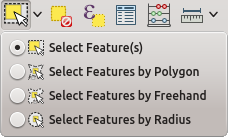

# Selecciones

Las selecciones son básicas para crear conjuntos de datos que cumplen una serie de condiciones logico-matemáticas o geométricas. Estos conjuntos de datos son susceptibles, posteriormente, de serles aplicada operaciones.

