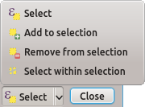

# Selecciones

Las selecciones son básicas para crear conjuntos de datos que cumplen una serie de condiciones logico-matemáticas o geométricas. Estos conjuntos de datos son susceptibles, posteriormente, de serles aplicada operaciones.

## Herramientas de selección

Existen varias herramientas de selección.


El primer icono es la herramienta de selección manual, que tiene varios modos de operación, seleccionables en el submenú:

- __Seleccionar geometría (Select Feature(s)):__ selecciona geometrías de la capa activa en el TOC bien por pinchazo individual o por dibujado de un recuadro;

- __Seleccionar geometrías por polígono (Select Features by Polygon):__ permite dibujar un polígono y seleccionar geometrías de la capa activa en el TOC por inclusión o intersección;

- __Seleccionar geometrías por dibujado libre (Select Features by Freehand):__ permite dibujar una forma libre y seleccionar geometrías en la capa activa del TOC por inclusión o intersección;

- __Seleccionar geometrías por radio (Select Features by Radius):__ permite determinar un punto y un radio pinchando y arrastrando y seleccionar geometrías de la capa activa en el TOC por inclusión o intersección.

La tecla __control__ (CTRL) permite añadir elementos a la selección, así como deseleccionarlos. Pulsándola mientras se realiza otra acción de selección manual, los nuevos elementos seleccionados se añadirán a la selección en curso, mientras que si se seleccionan elementos previamente seleccionados, serán eliminados de la selección.

El segundo icono deshace la selección actual.

Sin duda, la herramienta más potente de selección es la seleccionada por el trecer icono, la herramienta de selección por expresión. Su funcionamiento es análogo al de la calculadora de campos, pero en lugar de realizar una operación y almacenar el resultado en un campo, sirve para seleccionar datos.

Lo primero que se debe tener en cuenta es el modo de selección, modificable en el botón inferior izquierdo. Las opciones son:



- __Seleccionar (Select):__ elimina cualquier selección previa y la substituye por la que surja de la expresión en curso;

- __Añadir a selección (Add to selection):__ añade el resultado de la expresión a la selección previa;

- __Eliminar de la selección (Remove from selection):__ elimina el resultado de la expresión de la selección previa;

- __Seleccionar de la selección (Select within selection):__ selecciona el resultado de la expresión entre la selección previa.

__Ejemplo__

```
Seleccionar todas las construcciones urbanas de dos plantas.
```

En el modo de nueva selección:

```Sql
"constru" = "II"
```

```
Seleccionar del conjunto anterior las parcelas mayores de 70 metros cuadrados.
```

En el modo de selección dentro de la selección:

```Sql
$area > 70
```

