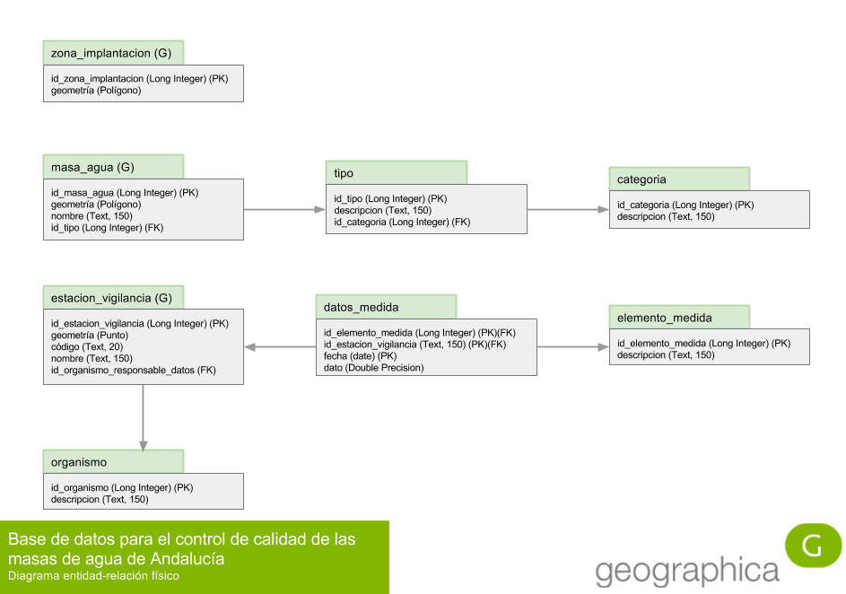

# Solución y discusión de la práctica

Lo primero que hay que abordar, antes de plantearse nada acerca de una implementación física, es el __modelo entidad-relación__, también llamado en sus siglas en inglés __ERM__ (Entity-Relationship Model). Este modelo entidad-relación permitirá formalizar el problema en una estructura de datos que, recordemos, persigue conseguir los siguientes objetivos:

* __atomicidad:__ los datos deben estar consignados en la base de datos en un estado lo suficientemente atomizado como para poder cumplir con los objetivos de los requerimientos de información planteados;

* __no redundancia:__ un dato debe estar consignado en la base de datos en un sólo lugar y una sola vez. Si no es así, la base de datos proporcionará distintas respuestas ante la misma pregunta si esta es preguntada de formas distintas.

Son las dos principales características de lo que llamamos __normalización__.

Como ya hemos hecho en ocasiones anteriores, comenzaremos el modelado con un análisis semántico progresivo de la descripción del problema, e iremos normalizando entidades hasta que el modelo esté normalizado y se cumplan los requisitos de información. Modelar sin objetivo es un esfuerzo inútil: podríamos estar tomando decisiones de diseño supérfluas que conducen a una mayor complejidad sin ganancias en las capacidades de análisis del modelo que merezcan la pena.

El modelo es bastante sencillo. Un modelo se puede dar por terminado cuando se cumplen las dos siguientes condiciones:

* __el modelo está normalizado:__ no se detecta ninguna causa de desnormalización en ninguna tabla;

* __el modelo es capaz de responder a las mínimos preguntas planteadas:__ por medio de consultas, se pueden obtener las respuestas que el problema plantea.

Para comprobar la primera condición, hay que hacer un esfuerzo de imaginación y pensar cómo funcionará cada tabla una vez se esté usando en la base de datos. Si vemos que se repiten datos o que se produce cualquier otro tipo de desnormalización, no estaremos cumpliendo el primer objetivo. Repasamos a continuación tabla a tabla, tanto en forma como en funcionalidad.

## zona_implantacion

| id_zona_implantacion | geometría |
| -------------------- | --------- |
| 1 | (Polígono) |

Esta tabla contendrá un único registro con la geometría de la zona de implantación de la Directiva en el litoral andaluz.

Cómo se puede apreciar, no se repite ningún dato en la tabla. _id_zona_implantacion_ es la clave primaria y por definición no se puede repetir. La geometría la zona de implantación también es única, por lo que no se producen redundancias. Esta tabla está correcta.

## masa_agua

| id_masa_agua | geometría | nombre | id_tipo |
| ------------ | --------- | ------ | ------- |
| 1 | (Polígono) | Nombre masa 1 | 1 |
| 2 | (Polígono) | Nombre masa 2 | 2 |
| 3 | (Polígono) | Nombre masa 3 | 1 |
| 4 | (Polígono) | Nombre masa 4 | 1 |
| ... | ... | ... | ... |

Esta tabla contiene el catálogo de masas de agua del litoral andaluz. Es un catálogo típico, con una clave primaria numérica, un registro por cada elemento y varios campos con características que describen el objeto masa de agua.

_id_masa_agua_ es clave primaria y por tanto no se repite. El polígono de cada masa de agua también será distinto, no tiene ningún sentido que haya dos masas de agua con la misma geometría. El _nombre_ de la masa de agua también debería ser distinto para facilitar su identificación, y en el caso de que se produjera alguna repetición, cosa un poco tonta, nos daría igual porque no vamos a hacer ningún análisis sobre dicho dato. En cuanto al _id_tipo_, es un campo clave foránea de la clave primaria de la tabla __tipo__, por lo que sus valores están, merced de la integridad referencial, controlados por dicha tabla, por lo que están acotados y no existe peligro de utilizar códigos de tipo inexistentes. Estos códigos se puede repetir en diversas masas, puesto que podemos tener varias masas de un mismo tipo. Por tanto, las repeticiones son lógicas y los posibles valores que puede tomar el campo están acotados por la clave primaria de otra tabla. Podríamos equivocarnos introduciendo un dato, pero en cualquier caso dicho dato no sería inexistente o carente de significado, que es lo que importa.

## tipo

La tabla tipo es un catálogo auxiliar para la tabla masa de agua que describe el tipo de masa de cada una de ellas. La relación entre masa de agua, tipo y categoría es compleja, ya que se basa en una relación por _transitividad_. Una masa de agua posee un tipo y una categoría, por lo que podría pensarse que la entidad _masa_agua_ establecira sendas relaciones directamente con tipo y categoría, tal y como se ve en la siguiente figura.

Sin embargo, entre tipo y categoría también existe una relación, puesto que los tipos son de una categoría en concreto: existen tipos de transición y tipos marinos. Por lo tanto, también podríamos pensar que hay que establecer una relación de uno a muchos entre tipo y transición:

Esto lo pone aún peor, ya que tenemos un ciclo, y los ciclos pueden llegar a ser muy peligrosos. Este es uno de los peores, ya que se puede caer en una redundancia que provoca inconsistencia. Por ejemplo, supongamos que modelamos de esta manera y ahora introducimos datos en el sistema:

__masa_agua__

| id_masa_agua | geometría | nombre | id_tipo | id_categoria |
| ------------ | --------- | ------ | ------- | ------------ |
| 1 | (Polígono) | Nombre masa 1 | 1 | 1 |

__tipo__

| id_tipo | descripcion | id_categoria |
| ------- | ----------- | ------------ |
| 1 | Plumas de estuarios mesomareales | 2 |

__categoria__

| id_categoria | descripcion |
| ------------ | ----------- |
| 1 | Transición |
| 2 | Marina |

Estas relaciones en ciclo provocan una inconsistencia, porque hay dos caminos para encontrar respuesta a esta pregunta: _¿qué categoría corresponde a la masa de agua número 1?_:

- __camino 1:__ la tabla _masa_agua_ tiene una relación directa con _categoria_. _id_categoria_ 1 significa _Transición_ en la tabla _categoria_, por lo tanto, según este camino, la masa de agua 1 es una masa de agua de _transición_;

- __camino 2:__ la tabla _masa_agua_ tiene una relación con _tipo_. _id_tipo_ 1 significa que es una masa de agua de tipo _Plumas de estuarios mesomareales_. Pero la tabla _tipo_ también tiene una relación con categoría, y la clave foránea en esta tabla dice que la categoría es 2, que según la tabla _categoria_ es _marina_.

Por lo tanto, la misma pregunta arroja respuestas contrapuestas dependiendo de cómo se resuelva la misma. Esto es lo peor que le puede pasar a un modelo.

La solución correcta es la apuntada en la figura 1. Existe una relación jerárquica entre tipo y categoría, estándo categoría en la cúspide de la jerarquía y tipo en la base, de forma que cada tipo tiene una categoría. La masa de agua se relaciona con el elemento más bajo de la jerarquía, en este caso tipo. Si una masa de agua tiene un tipo, y ese tipo tiene una categoría, entonces, por __transitividad__, la masa de agua tiene una __categoría__: la de su __tipo__.

## categoria

La tabla __categoria__ es un simple catálogo con una clave primaria y una descripción. Su compleja relación con _masa_agua_ y _tipo_  ya ha sido descrita anteriormente.

## estacion_vigilancia

La tabla __estacion_vigilancia__ es el catálogo de estaciones de vigilancia. Tiene una clave primaria _id_estacion_vigilancia_, una geometría puntual, un código, un nombre y una clave foránea de la tabla _organismo_, _id_organismo_responsable_datos_.

## organismo

La tabla __organismo__ es el catálogo de organismos al cargo de la toma de datos. Es un catálogo típico, con una clave primaria _id_organismo_ y una descripción en el campo _descripcion_.

## elemento_medida

__elemento_medida__ es el catálogo de elementos de medida, típico a rabiar. Clave primaria en _id_elemento_medida_ y descripción en _descripcion_.

## datos_medida

Aquí está la relación más compleja del modelo. Como siempre, lo más difícil no es modelar objetos más o menos tangibles del mundo real (una masa de agua, una estación de vigilancia, un elemento de calidad, etc.), sino modelar procesos intangibles que se desarrollan entre los elementos "tangibles" del modelo. La tabla __datos_medida__ codifica el acto de la toma de datos, y, como siempre, lo más importante para que funcione correctamente es acotar con precisión y certeza el proceso de toma de datos. Lo mejor es observar el desarrollo real del proceso. La toma de datos consiste en un operario que va a campo, a un lugar preciso con coordenadas bien conocidas, y en un momento concreto, y toma una muestra de agua que es llevada a laboratorio para ser sometida a diversos procesos de análisis con el objetivo de encontrar la medida de presencia de un determinado elemento de calidad en la muestra. POr lo tanto, un análisis involucra a un lugar (una estación de vigilancia), un momento concreto (una fecha, con precisión de día, ya que la hora es irrelevante para la escala del problema), en busca de un elemento de calidad en concreto (el pH, la clorofila, etc.), y del que finalmente se obtiene una medida (el dato).

Podría pensarse que una toma de datos es multimedida, es decir, que se analiza una muestra de agua con el objetivo de encontrar simultáneamente la medida de varios elementos de calidad. Por ello, podría pensarse que la relación entre __datos_medida__ y __elemento_calidad__ debería ser de muchos a muchos: un análisis, muchas medidas. Esto es viable y podría modelarse de esa manera, y tendría sus propias ventajas, aunque desembocaría en un modelo más complejo. Hay que recordar siempre que el modelado perfecto no existe, sólo modelos convenientes. El modelado es siempre un equilibrio entre funcionalidad y complejidad: a más complejo, más funcional, pero más difícil de manejar y posiblemente más propenso a fallos. No hay que excederse: si nos excedemos en complejidad, puede que las ventajas que obtengamos no justifiquen el aumento de complejidad. En cuanto los objetivos de __normalización__ y de __necesidades de información__ están cumplidos, el modelado puede concluir.

La versión del análisis multi elemento sería así:

Hemos prescindido de la tabla __datos_medida__ para pasar a una tabla __analisis__, en la que se recogen los datos del mismo, que son simplemente el lugar dónde se ha realizado (_id_estacion_vigilancia_) y la fecha.

Es muy importante destacar el papel de las claves primarias en esta parte del modelo. Hay que recordar que la elección correcta de las claves en el modelo condiciona no sólo la correcta relación entre tablas gracias al mecanismo clave primaria, sino un elemento fundamental para la integridad y coherencia de los datos.

Clave primaria de datos_medida

## Relaciones topológicas
