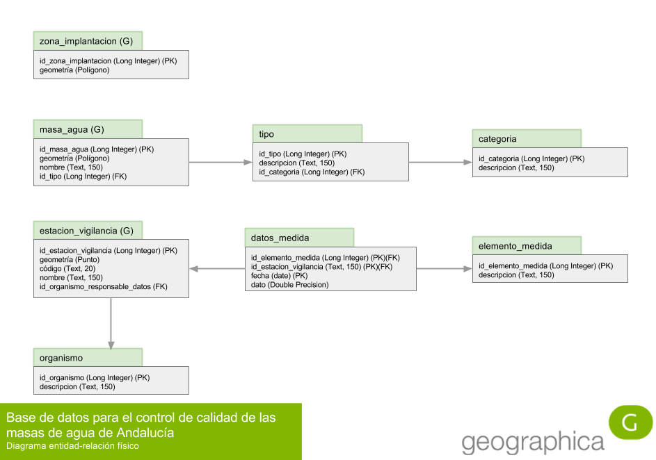

# Solución y discusión de la práctica

Lo primero que hay que abordar, antes de plantearse nada acerca de una implementación física, es el __modelo entidad-relación__, también llamado en sus siglas en inglés __ERM__ (Entity-Relationship Model). Este modelo entidad-relación permitirá formalizar el problema en una estructura de datos que, recordemos, persigue conseguir los siguientes objetivos:

* __atomicidad:__ los datos deben estar consignados en la base de datos en un estado lo suficientemente atomizado como para poder cumplir con los objetivos de los requerimientos de información planteados;

* __no redundancia:__ un dato debe estar consignado en la base de datos en un sólo lugar y una sola vez. Si no es así, la base de datos proporcionará distintas respuestas ante la misma pregunta si esta es preguntada de formas distintas.

Son las dos principales características de lo que llamamos __normalización__.

Como ya hemos hecho en ocasiones anteriores, comenzaremos el modelado con un análisis semántico progresivo de la descripción del problema, e iremos normalizando entidades hasta que el modelo esté normalizado y se cumplan los requisitos de información. Modelar sin objetivo es un esfuerzo inútil: podríamos estar tomando decisiones de diseño supérfluas que conducen a una mayor complejidad sin ganancias en las capacidades de análisis del modelo que merezcan la pena.

El modelo es bastante sencillo. Un modelo se puede dar por terminado cuando se cumplen las dos siguientes condiciones:

* __el modelo está normalizado:__ no se detecta ninguna causa de desnormalización en ninguna tabla;

* __el modelo es capaz de responder a las mínimos preguntas planteadas:__ por medio de consultas, se pueden obtener las respuestas que el problema plantea.

Para comprobar la primera condición, hay que hacer un esfuerzo de imaginación y pensar cómo funcionará cada tabla una vez se esté usando en la base de datos. Si vemos que se repiten datos o que se produce cualquier otro tipo de desnormalización, no estaremos cumpliendo el primer objetivo. Repasamos a continuación tabla a tabla.

## zona_implantacion

| id_zona_implantacion | geometría |
| -------------------- | --------- |
| 1 | (Polígono) |

Cómo se puede apreciar, no se repite ningún dato en la tabla. _id_zona_implantacion_ es la clave primaria y por definición no se puede repetir. La geometría la zona de implantación también es única, por lo que no se producen redundancias. Esta tabla está correcta.

## masa_agua

| id_masa_agua | geometría | nombre | id_tipo |
| ------------ | --------- | ------ | ------- |
| 1 | (Polígono) | Nombre masa 1 | 1 |
| 2 | (Polígono) | Nombre masa 2 | 2 |
| 3 | (Polígono) | Nombre masa 3 | 1 |
| 4 | (Polígono) | Nombre masa 4 | 1 |
| ... | ... | ... | ... |

_id_masa_agua_ es clave primaria y por tanto no se repite. El polígono de cada masa de agua también será distinto, no tiene ningún sentido que haya dos masas de agua con la misma geometría. El _nombre_ de la masa de agua también debería ser distinto para facilitar su identificación, y en el caso de que se produjera alguna repetición, cosa un poco tonta, nos daría igual porque no vamos a hacer ningún análisis sobre dicho dato. En cuanto al _id_tipo_, es un campo clave foránea de la clave primaria de la tabla __tipo__, por lo que sus valores están, merced de la integridad referencial, controlados por dicha tabla, por lo que están acotados y no existe peligro de utilizar códigos de tipo inexistentes. Estos códigos se puede repetir en diversas masas, puesto que podemos tener varias masas de un mismo tipo. Por tanto, las repeticiones son lógicas y los posibles valores que puede tomar el campo están acotados por la clave primaria de otra tabla. Podríamos equivocarnos introduciendo un dato, pero en cualquier caso dicho dato no sería inexistente o carente de significado, que es lo que importa.

## tipo

