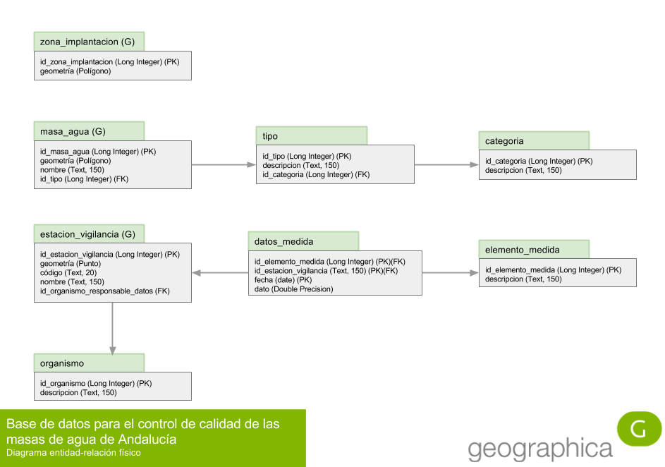

# Solución y discusión de la práctica

Lo primero que hay que abordar, antes de plantearse nada acerca de una
implementación física, es el __modelo entidad-relación__, también llamado en sus
siglas en inglés __ERM__ (Entity-Relationship Model). Este modelo
entidad-relación permitirá formalizar el problema en una estructura de datos
que, recordemos, persigue conseguir los siguientes objetivos:

* __atomicidad:__ los datos deben estar consignados en la base de datos en un
  estado lo suficientemente atomizado como para poder cumplir con los objetivos
  de los requerimientos de información planteados;

* __no redundancia:__ un dato debe estar consignado en la base de datos en un
  sólo lugar y una sola vez. Si no es así, la base de datos proporcionará
  distintas respuestas ante la misma pregunta si esta es preguntada de formas
  distintas.

Son las dos principales características de lo que llamamos __normalización__.

Como ya hemos hecho en ocasiones anteriores, comenzaremos el modelado con un
análisis semántico progresivo de la descripción del problema, e iremos
normalizando entidades hasta que el modelo esté normalizado y se cumplan los
requisitos de información. Modelar sin objetivo es un esfuerzo inútil: podríamos
estar tomando decisiones de diseño supérfluas que conducen a una mayor
complejidad sin ganancias en las capacidades de análisis del modelo que merezcan
la pena.

